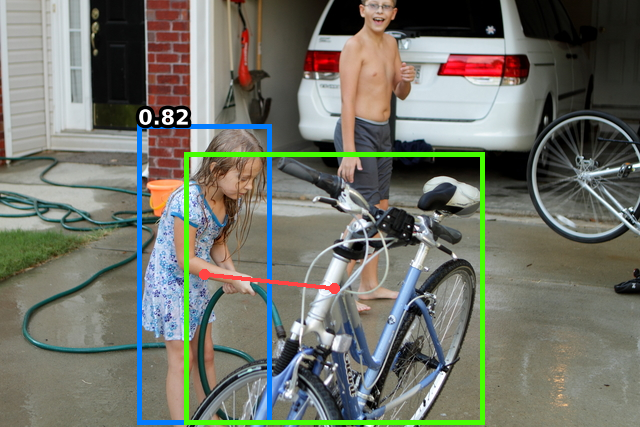
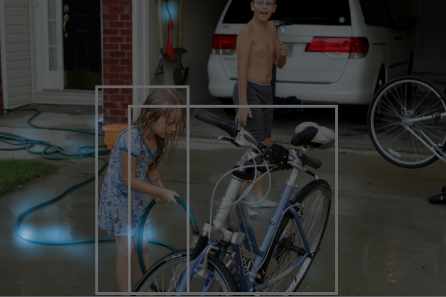
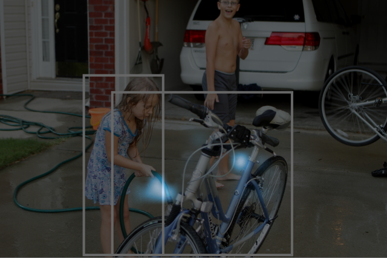

# PViC: Predicate Visual Context

This repository contains the official PyTorch implementation for the paper
> Frederic Z. Zhang, Yuhui Yuan, Dylan Campbell, Zhuoyao Zhong, Stephen Gould; _Exploring Predicate Visual Context for Detecting Human-Object Interactions_; In Proceedings of the IEEE/CVF International Conference on Computer Vision (ICCV), 2023, pp. 10411-10421.

\[[__preprint__](https://arxiv.org/pdf/2308.06202.pdf)\]
\[[__paper__](https://openaccess.thecvf.com/content/ICCV2023/html/Zhang_Exploring_Predicate_Visual_Context_in_Detecting_of_Human-Object_Interactions_ICCV_2023_paper.html)\]
\[[__video__](https://www.youtube.com/watch?v=iYqOAXJFqpU)\]

## Abstract
> Recently, the DETR framework has emerged as the dominant approach for human–object interaction (HOI) research. In particular, two-stage transformer-based HOI detectors are amongst the most performant and training-efficient approaches. However, these often condition HOI classification on object features that lack fine-grained contextual information, eschewing pose and orientation information in favour of visual cues about object identity and box extremities. This naturally hinders the recognition of complex or ambiguous interactions. In this work, we study these issues through visualisations and carefully designed experiments. Accordingly, we investigate how best to re-introduce image features via cross-attention. With an improved query design, extensive exploration of keys and values, and box pair positional embeddings as spatial guidance, our model with enhanced predicate visual context (PViC) outperforms state-of-the-art methods on the HICO-DET and V-COCO benchmarks, while maintaining low training cost.

## Prerequisites

1. Use the package management tool of your choice and run the following commands after creating your environment. 
    ```bash
    # Say you are using Conda
    conda create --name pvic python=3.8
    conda activate pvic
    # Required dependencies
    pip install torch==1.8.0+cu111 torchvision==0.9.0+cu111 -f https://download.pytorch.org/whl/torch_stable.html
    pip install matplotlib==3.6.3 scipy==1.10.0 tqdm==4.64.1
    pip install numpy==1.24.1 timm==0.6.12
    pip install wandb==0.13.9 seaborn==0.13.0
    # Clone the repo and submodules
    git clone https://github.com/fredzzhang/pvic.git
    cd pvic
    git submodule init
    git submodule update
    pip install -e pocket
    # Build CUDA operator for MultiScaleDeformableAttention
    cd h_detr/models/ops
    python setup.py build install
    ```
2. Prepare the [HICO-DET dataset](https://drive.google.com/open?id=1QZcJmGVlF9f4h-XLWe9Gkmnmj2z1gSnk).
    1. If you have not downloaded the dataset before, run the following script.
        ```bash
        cd /path/to/pvic/hicodet
        bash download.sh
        ```
    2. If you have previously downloaded the dataset, simply create a soft link.
        ```bash
        cd /path/to/pvic/hicodet
        ln -s /path/to/hicodet_20160224_det ./hico_20160224_det
        ```
3. Prepare the V-COCO dataset (contained in [MS COCO](https://cocodataset.org/#download)).
    1. If you have not downloaded the dataset before, run the following script
        ```bash
        cd /path/to/pvic/vcoco
        bash download.sh
        ```
    2. If you have previously downloaded the dataset, simply create a soft link
        ```bash
        cd /path/to/pvic/vcoco
        ln -s /path/to/coco ./mscoco2014
        ```

## Inference

Visualisation utilities are implemented to run inference on a single image and visualise the cross-attention weights. A [reference model](https://drive.google.com/file/d/12ow476JpjrRNGMRd1f2DN_YJTOqtaOly/view?usp=sharing) is provided for demonstration purpose if you don't want to train a model yourself. Download the model and save it to `./checkpoints/`. Use the argument `--index` to select images and `--action` to specify the action index. Refer to the [lookup table](https://github.com/fredzzhang/upt/blob/main/assets/actions.txt) for action indices.

```bash
DETR=base python inference.py --resume checkpoints/pvic-detr-r50-hicodet.pth --index 4050 --action 111
```

The detected human-object pairs with scores overlayed are saved to `fig.png`, while the attention weights are saved to `pair_xx_attn_head_x.png`. Below are some sample outputs.

&nbsp;&nbsp;&nbsp;&nbsp;

In addition, the argument `--image-path` enables inference on custom images.

## Training and Testing

Refer to the [documentation](docs.md) for model checkpoints and training/testing commands.

## License

PViC is released under the [BSD-3-Clause License](./LICENSE).

## Citation

If you find our work useful for your research, please consider citing us:

```bibtex
@inproceedings{zhang2023pvic,
  author    = {Zhang, Frederic Z. and Yuan, Yuhui and Campbell, Dylan and Zhong, Zhuoyao and Gould, Stephen},
  title     = {Exploring Predicate Visual Context in Detecting Human–Object Interactions},
  booktitle = {Proceedings of the IEEE/CVF International Conference on Computer Vision (ICCV)},
  month     = {October},
  year      = {2023},
  pages     = {10411-10421},
}

@inproceedings{zhang2022upt,
  author    = {Zhang, Frederic Z. and Campbell, Dylan and Gould, Stephen},
  title     = {Efficient Two-Stage Detection of Human-Object Interactions with a Novel Unary-Pairwise Transformer},
  booktitle = {Proceedings of the IEEE/CVF Conference on Computer Vision and Pattern Recognition (CVPR)},
  month     = {June},
  year      = {2022},
  pages     = {20104-20112}
}

@inproceedings{zhang2021scg,
  author    = {Zhang, Frederic Z. and Campbell, Dylan and Gould, Stephen},
  title     = {Spatially Conditioned Graphs for Detecting Human–Object Interactions},
  booktitle = {Proceedings of the IEEE/CVF International Conference on Computer Vision (ICCV)},
  month     = {October},
  year      = {2021},
  pages     = {13319-13327}
}
```
